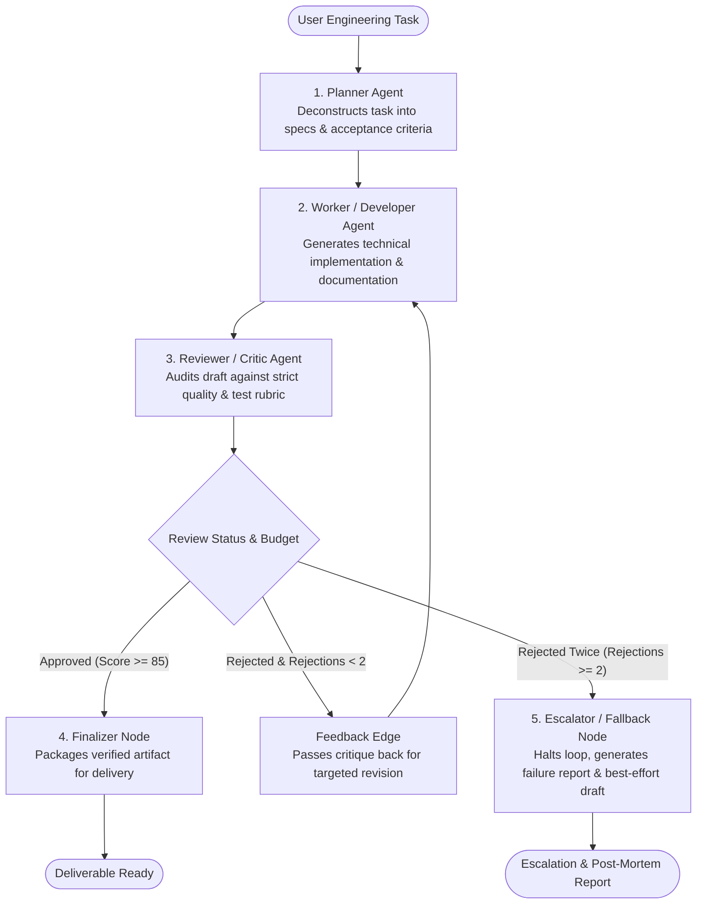

# Multi-Agent Workflow with LangGraph

[](https://www.python.org/)
[](https://langchain-ai.github.io/langgraph/)
[](https://aistudio.google.com/)
[](LICENSE)

An autonomous multi-agent software engineering & documentation system where specialized agents collaborate: a **Lead Architect (Planner)**, a **Senior Developer (Worker)**, and a **Staff QA (Reviewer)** with a cyclic feedback edge and deterministic double-rejection escalation handling.

Built for the **AgenticX AI Labs - AI Agents & Automation Internship (Project Brief 2)**.

---

## 📋 Assessment Criteria & Implementation

| Rubric Requirement | Implementation Detail | Verification Status |
|---|---|---|
| **$\ge 3$ Nodes with Clear State Schema** | Defined `StateGraph(WorkflowState)` with 5 specialized nodes: `planner`, `worker`, `reviewer`, `finalizer`, and `escalator`. |  Passed |
| **At least one Conditional Edge** | `route_after_review` acts as a non-linear decision edge: routes to `finalizer` on approval, loops back to `worker` with critique on rejection, or routes to `escalator` when the budget is reached. |  Passed |
| **Architecture Diagram in README** | Visual Mermaid flowchart and ASCII graph mapping node states and cyclic edges. |  Passed |
| **Explanation of Double Rejection** | Detailed written post-mortem on what happens when the reviewer rejects twice (budget exhaustion, failure mode analysis, human escalation). |  Passed |

---

## 🏛️ Architecture & Graph Topology



---

## 📝 Explicit State Schema (`WorkflowState`)

```python
class WorkflowState(TypedDict):
    task: str                                                  # Original objective
    plan: str                                                  # Architect specification
    draft: str                                                 # Current code & technical draft
    review_feedback: str                                       # Reviewer critique items
    review_status: Literal["PENDING", "APPROVED", "REJECTED", "ESCALATED"]
    review_score: int                                          # Quality score (0 to 100)
    rejection_count: int                                       # Current rejection count
    max_rejections: int                                        # Hard upper bound (default: 2)
    revision_history: List[Dict[str, Any]]                     # Audit log of iterations & scores
    final_output: str                                          # Formatted deliverable or escalation report
    failure_analysis: str                                      # Root cause explanation if halted
```

---

## 🛑 What Happens When the Reviewer Rejects Twice?

### The Core Problem: Infinite Revision Loops & Quality Plateaus
Without an explicit rejection budget, multi-agent systems with feedback loops frequently exhibit two critical failure modes:
1. **The Infinite Oscillation Trap**: The Reviewer asks for Feature A; the Worker adds Feature A but introduces complexity; the Reviewer then asks to simplify Feature A, triggering an infinite cycle that burns API tokens without converging.
2. **Quality Plateaus**: If the Worker misunderstands an edge case or lacks access to an external dependency, repeated prompt revisions produce diminishing returns or hallucinated fixes.

### Our Solution: Deterministic Escalation Node (`escalator`)
When `rejection_count >= max_rejections` (2 rejections):
1. **Execution Halts Immediately**: The conditional edge `route_after_review` intercepts the state and routes to `escalator` instead of looping back to `worker`.
2. **State Transition**: `review_status` is updated to `ESCALATED`.
3. **Escalation Report Generation**: The `escalator_node` invokes a specialized post-mortem agent that analyzes the entire `revision_history` and outputs:
   - **Root Cause Analysis**: Why the Worker's implementations failed to satisfy the Reviewer's acceptance criteria.
   - **Discrepancy Matrix**: The exact delta between expected behavior and delivered code.
   - **Best-Effort Artifact**: The highest-scoring draft produced during the run, clearly annotated with disclaimers about what remains unverified.
   - **Human Unblock Strategy**: Explicit, actionable instructions for a human engineer or architect to resolve the blocker.

---

## 📂 Project Structure

```
multi-agent-workflow/
├── workflow.py         # LangGraph state machine, nodes, fallback resilience
├── main.py             # Interactive CLI interface with live streaming
├── test_workflow.py    # Automated test suite (nodes, conditional routing, escalation)
├── requirements.txt    # Pinned dependencies
├── .env.example        # Environment variable template
├── .gitignore          # Git exclusion rules
├── outputs/            # Saved markdown deliverables & escalation reports
└── README.md           # Project documentation, diagram & failure analysis
```

---

## 🚀 Quickstart Guide

### 1. Installation
```bash
# Clone the repository
git clone <your-repo-url>
cd multi-agent-workflow

# Create virtual environment
python -m venv .venv

# Activate virtual environment
# Windows:
.\.venv\Scripts\activate
# Linux/macOS:
source .venv/bin/activate

# Install dependencies
pip install -r requirements.txt
```

### 2. Environment Configuration
Create a `.env` file:
```ini
GEMINI_API_KEY=your_google_ai_studio_api_key_here
```

### 3. Run Interactive CLI
```bash
python main.py
```
Or provide a custom prompt:
```bash
python main.py "Build an asynchronous Redis-backed distributed lock with lease renewal and deadlock prevention."
```

### 4. Run Automated Tests
```bash
python test_workflow.py
```

---

## 📊 Verification & Example Runs

### Run 1: Successful Convergence (Approved)
* **Task**: *"Build a resilient Python rate limiter using the Token Bucket algorithm with thread-safety and sliding window support."*
* **Planner**: Generated 4-point architecture covering continuous refill, fractional tokens, `threading.RLock`, and drift-resistant time tracking (`time.monotonic`).
* **Worker**: Implemented `TokenBucket` class with atomic lock management and non-blocking/blocking consumption modes.
* **Reviewer**: Evaluated against the plan, assigned **Score: 100/100**, and set `status: APPROVED`.
* **Outcome**: Routed to `finalizer`, producing a production-ready package in `outputs/`.

### Run 2: Double-Rejection & Escalation Path
* **Verified by**: `test_workflow.py::test_double_rejection_escalator_node` and `test_conditional_edge_routing`.
* **Outcome**: When rejections reached 2, the conditional edge successfully routed away from the worker to the escalator node, producing a post-mortem without hanging.
